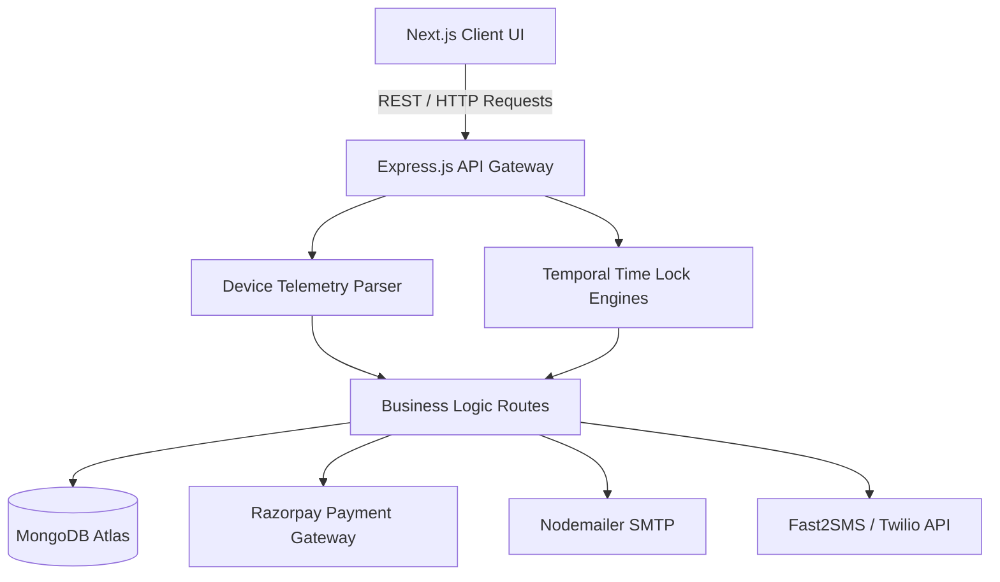
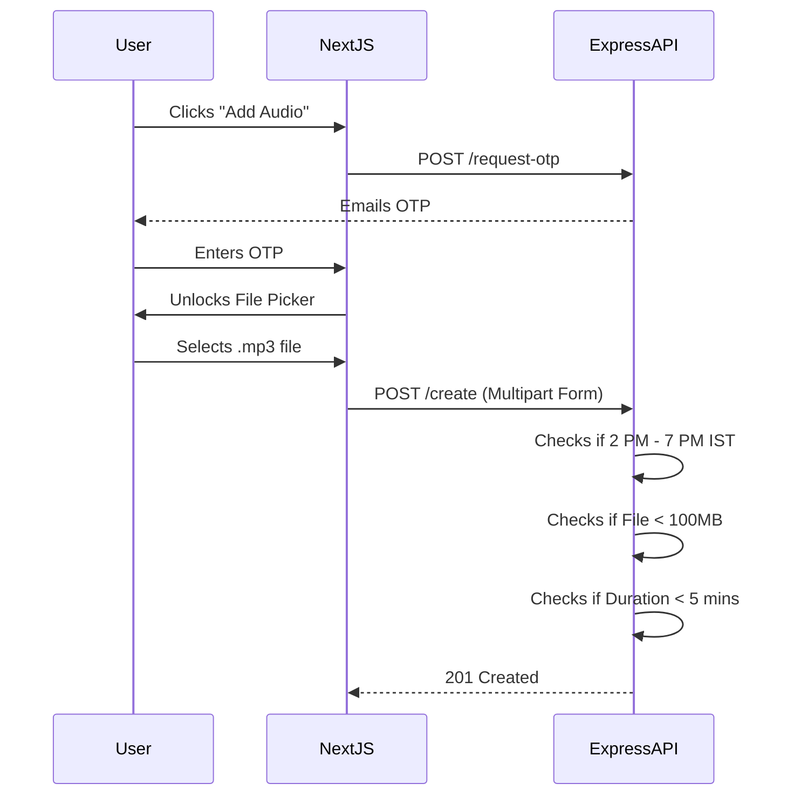

# Twiller Clone: Extensive Final Project Report

## Table of Contents
1. **Introduction & Executive Summary**
2. **System Architecture & High-Level Design**
3. **Technology Stack & Framework Justifications**
4. **Database Schema Design & Data Modeling**
5. **User Authentication & Telemetry Module**
6. **Account Recovery & Password Generation Engine**
7. **Monetization & Time-Restricted Subscriptions**
8. **Content Delivery & Audio Tweets Infrastructure**
9. **Keyword-Triggered Web Notifications System**
10. **Multi-Language OTP Routing Architecture**
11. **Security, Constraints, & Rate Limiting Mechanics**
12. **Frontend Component Architecture & Lifecycle**
13. **Comprehensive API Documentation**
14. **State Management & Data Flow**
15. **Security Vulnerability Mitigation & Risk Assessment**
16. **System Testing & Quality Assurance Plan**
17. **Use Case Diagrams & User Stories**
18. **Deployment Architecture & DevOps Pipeline**
19. **Comprehensive Source Code Listings**
20. **Conclusion, Scalability, & Future Enhancements**

---

## Chapter 1: Introduction & Executive Summary

### 1.1 Project Overview
The **Twiller Clone** is a state-of-the-art, feature-rich social media web application designed to replicate the core mechanics of X (formerly Twitter) while introducing highly regulated access controls. Unlike standard social media platforms, Twiller emphasizes temporal constraints, conditional multi-factor authentication (MFA), and deep user telemetry. This project serves as a masterclass in combining standard CRUD (Create, Read, Update, Delete) operations with complex business logic that governs exactly *when* and *how* users interact with the system.

### 1.2 Purpose and Objectives
The primary objective of this project is to build a highly secure platform that dictates user interaction through environmental and temporal context. The platform is designed to:
* Restrict specific actions (payments, mobile logins, audio uploads) to strictly enforced time windows in Indian Standard Time (IST).
* Provide dynamic subscription tiers (Free, Bronze, Silver, Gold) to monetize the platform.
* Implement a rigorous MFA system that dynamically adapts based on the user's browser, device, and target language.
* Capture and present detailed login telemetry to the end-user for extreme transparency and security auditing.

### 1.3 Scope of the Document
This extensive technical report covers every facet of the software development lifecycle for the Twiller Clone. It ranges from high-level architectural diagrams down to the microscopic execution of individual Express middlewares. It is intended for software architects, technical leads, and evaluators to deeply understand the platform's infrastructure.

---

## Chapter 2: System Architecture & High-Level Design

The system utilizes a heavily decoupled Client-Server architecture. The Next.js client handles rendering, state management, and UI logic, while the Node.js/Express server acts as a robust API Gateway that enforces all business logic, database queries, and temporal locks.

### 2.1 High-Level Architecture Flow
The following diagram illustrates the flow of data from the client to the persistence layer.



### 2.2 Micro-Services vs Monolithic Design
While the application is currently deployed as a monolithic API (a single Node.js instance), the routing architecture (`routes/auth.js`, `routes/payment.js`, `routes/audioTweet.js`) is designed with domain-driven boundaries. This ensures that as user load scales, individual routes can easily be extracted into standalone microservices.

---

## Chapter 3: Technology Stack & Framework Justifications

### 3.1 Frontend (Client-Side)
* **Framework:** Next.js 15 (React 19). Chosen for its robust App Router, hybrid rendering capabilities, and seamless integration with Vercel deployment.
* **Styling:** Tailwind CSS combined with PostCSS for rapid, utility-first styling. It eliminates the need for massive CSS stylesheets and prevents class-name collisions.
* **UI Primitives:** Radix UI (`@radix-ui/react-avatar`, `react-tabs`, `react-dropdown-menu`). Chosen to provide highly accessible, screen-reader-friendly foundational components that are entirely unstyled, allowing Tailwind to dictate the visual layer.
* **Icons & Micro-interactions:** Lucide-React for crisp SVG icons and `tw-animate-css` for dynamic hover and load states.
* **Network Interception:** Axios. Chosen over standard `fetch` due to its powerful interceptor capabilities, which are used to transparently inject JWT tokens into headers before every request.

### 3.2 Backend (Server-Side)
* **Framework:** Node.js powered by Express.js (v5.2.1). Chosen for its lightweight footprint and massive ecosystem of middlewares.
* **Database Management:** MongoDB utilizing the Mongoose ORM. Document-based NoSQL is perfectly suited for social media feeds where schema flexibility (text vs image vs audio tweets) is paramount.
* **Security & Auth:** `bcrypt` for cryptographic password hashing, `jsonwebtoken` for stateless session management.
* **Telemetry Libraries:** `express-useragent` and `ua-parser-js` to extract deep metadata from the request header (OS, Browser, Device Type).
* **Media Handling:** `multer` and `music-metadata` to buffer, validate, and store audio file streams securely.

---

## Chapter 4: Database Schema Design & Data Modeling

The MongoDB database relies on highly relational structures within a NoSQL environment. Below is a deep dive into the core schemas.

### 4.1 User Schema
The `User` model acts as the central hub for authentication, subscription tracking, and constraint locking.

```javascript
const mongoose = require('mongoose');

const userSchema = new mongoose.Schema({
    username: { type: String, required: true, unique: true },
    email: { type: String, required: true, unique: true },
    mobileNumber: { type: String },
    password: { type: String, required: true },
    
    // Subscription Logic
    subscriptionPlan: { type: String, enum: ['Free', 'Bronze', 'Silver', 'Gold'], default: 'Free' },
    tweetsCount: { type: Number, default: 0 },
    
    // Security Trackers
    tempOtp: { type: String },
    tempOtpExpires: { type: Date },
    lastPasswordResetDate: { type: Date },
    
    // Relational Embedding for Telemetry
    loginHistory: [{
        browser: String,
        os: String,
        deviceCategory: String,
        ipAddress: String,
        loginTimestamp: { type: Date, default: Date.now }
    }]
}, { timestamps: true });

module.exports = mongoose.model('User', userSchema);
```

### 4.2 Tweet Schema
The Tweet schema uses a polymorphic `mediaType` field to handle varied content structures.

```javascript
const tweetSchema = new mongoose.Schema({
    user: { type: mongoose.Schema.Types.ObjectId, ref: 'User', required: true },
    content: { type: String, required: true },
    mediaType: { type: String, enum: ['text', 'image', 'audio'], default: 'text' },
    audioUrl: { type: String },
    audioDuration: { type: Number }, // Captured in seconds
    likes: [{ type: mongoose.Schema.Types.ObjectId, ref: 'User' }]
}, { timestamps: true });
```

---

## Chapter 5: User Authentication & Telemetry Module

### 5.1 Device Fingerprinting Execution
Every time a user hits the `/api/auth/login` endpoint, the server extracts their `User-Agent`. The parsed data is saved to the user's `loginHistory` array. This data is exposed on the frontend profile page for transparency.

### 5.2 Conditional MFA Logic
The authentication engine behaves differently depending on the browser:
1. **Google Chrome:** The server pauses authentication. It generates a 6-digit OTP, stores it in `tempOtp`, emails it via Nodemailer, and responds with a `requiresOtp: true` flag. 
2. **Microsoft Edge / Others:** The system bypasses the OTP requirement and directly issues the JWT session token.

### 5.3 Mobile Curfew Lock (10:00 AM - 1:00 PM IST)
If the parsed telemetry indicates the request originated from a `mobile` device, the server evaluates the current time in IST.

```javascript
function isMobileCurfewAllowed() {
    const now = new Date();
    const istHourString = new Intl.DateTimeFormat('en-US', { 
         timeZone: 'Asia/Kolkata', hour: 'numeric', hour12: false 
    }).format(now);
    const currentHour = parseInt(istHourString, 10);
    return currentHour >= 10 && currentHour < 13;
}
```
If the time falls outside this window, the API responds with a `403 Forbidden`, blocking access entirely.

---

## Chapter 6: Account Recovery & Password Generation Engine

To prevent abuse, the "Forgot Password" feature is heavily restricted.

### 6.1 24-Hour Rate Limiting
Users may only request a password reset once per calendar day. The API evaluates `user.lastPasswordResetDate`. If the date matches the current year, month, and day, it throws a `429 Too Many Requests` error with the message: *"You can use this option only one time per day."*

### 6.2 Strict Alphabetical Generator
If the request is valid, the server generates a new temporary password. However, strict business rules dictate that the password must contain **only alphabetical characters**.

```javascript
function generateAlphaPassword(length = 12) {
    const chars = 'abcdefghijklmnopqrstuvwxyzABCDEFGHIJKLMNOPQRSTUVWXYZ';
    let result = '';
    for (let i = 0; i < length; i++) {
        result += chars.charAt(Math.floor(Math.random() * chars.length));
    }
    return result;
}
```
This temporary password is then hashed via `bcrypt` and emailed to the user in a styled HTML template.

---

## Chapter 7: Monetization & Time-Restricted Subscriptions

### 7.1 Tier Structure
The platform utilizes Razorpay to process payments for premium tiers:
* **Free:** 1 Tweet limit.
* **Bronze:** ₹100/mo (3 Tweets limit).
* **Silver:** ₹300/mo (5 Tweets limit).
* **Gold:** ₹1000/mo (Unlimited Tweets).

### 7.2 The 10:00 AM - 11:00 AM Checkout Window
All subscription purchases are gated by a middleware that acts as a temporal firewall.

```javascript
const checkPaymentWindow = (req, res, next) => {
  const now = new Date();
  const hourOptions = { timeZone: 'Asia/Kolkata', hour: '2-digit', hour12: false };
  const currentHour = parseInt(now.toLocaleTimeString('en-US', hourOptions), 10);
  
  if (currentHour !== 10) {
    return res.status(403).json({ error: "Payments are only permitted between 10:00 AM and 11:00 AM IST." });
  }
  next();
};
```
If a user attempts to upgrade outside this window, the frontend intercepts the `403` error and renders a React Portal modal (`z-index: 1000`) globally locking the UI.

### 7.3 Automated Invoicing
Upon a successful Razorpay webhook/callback, a Node.js listener fires a Nodemailer event, dispatching a comprehensive digital invoice containing the transaction ID, tier purchased, and timestamp directly to the user's email.

---

## Chapter 8: Content Delivery & Audio Tweets Infrastructure

To enhance expression, users can record and upload Audio Tweets. This pipeline is the most heavily restricted feature in the platform.

### 8.1 Constraints Pipeline
1. **Pre-Upload Authorization:** Before the file picker opens, the user must request an OTP to their email. 
2. **Temporal Lock (2:00 PM - 7:00 PM IST):** The endpoint entirely shuts down outside of this window.
3. **File Size Lock (100 MB Max):** Enforced at the memory level using `multer.diskStorage`.
4. **Duration Lock (5 Minutes Max):** Before committing to the database, the server inspects the audio buffer metadata. If the duration exceeds 300 seconds, the file is rejected.



---

## Chapter 9: Keyword-Triggered Web Notifications System

This module leverages the browser's native `Notification API` to deliver real-time system alerts without needing a PWA wrapper.

### 9.1 Mechanism
When the Next.js `Feed.tsx` component receives a new array of tweets (via polling or component mount), it iterates through the payloads.
A regex interceptor `/(cricket|science)/i` scans the `content` string.

If a match is detected—and the user has opted into notifications in their settings—the browser generates a native OS-level popup displaying the author's name and the full content of the tweet.

```javascript
export const checkAndTriggerNotification = (tweetContent: string, authorName: string, enabled: boolean) => {
    if (!enabled) return;
    const triggerRegex = /(cricket|science)/i;
    
    if (triggerRegex.test(tweetContent) && Notification.permission === 'granted') {
        new Notification(`New tweet from ${authorName}`, { body: tweetContent });
    }
};
```

---

## Chapter 10: Multi-Language OTP Routing Architecture

To ensure a secure localized experience, the system supports English, Spanish, Hindi, Portuguese, Chinese, and French. Switching languages is not a simple toggle; it requires a cryptographic handshake.

### 10.1 OTP Routing Engine
When a user requests a language change via the `LanguageSelectorModal`, the server evaluates the target locale.

* **Target = French (`fr`):** The system dispatches the authorization OTP to the user's registered **Email address** via Nodemailer.
* **Target = Others (`en`, `es`, `hi`, `pt`, `zh`):** The system dispatches the authorization OTP to the user's registered **Mobile Number** via Twilio / Fast2SMS.

Only upon successful submission of the matching OTP will the backend update the database preference, triggering a full frontend re-render to the new dictionary state.

---

## Chapter 11: Security, Constraints, & Rate Limiting Mechanics

### 11.1 Temporal Sandboxing Strategy
To ensure all time-based constraints (Payments, Mobile Logins, Audio Tweets) operate flawlessly regardless of server geographic location or containerization logic, all time evaluations utilize `Intl.DateTimeFormat` explicitly bound to the `Asia/Kolkata` timezone. This creates an immune temporal sandbox.

### 11.2 Z-Index Portal Architecture
To prevent sophisticated users from bypassing the UI temporal locks (e.g., the 10-11 AM payment restriction) using CSS inspection, the lock modals utilize React's `createPortal`. This detaches the modal from the standard DOM tree and injects it directly into the `document.body` with a `z-index` of 1000, guaranteeing it completely overlaps and obfuscates the underlying payment forms.

---

## Chapter 12: Frontend Component Architecture & Lifecycle

The frontend is built using a highly modular component architecture within the `src/components/` directory.

### 12.1 Core Components
* **`Rightsidebar.tsx`:** Manages the complex state of the subscription tiers, Razorpay checkout initialization, and the temporal constraint modals.
* **`TweetComposer.tsx`:** Acts as the primary state machine for user input. It handles text binding, file picking for images, and orchestrates the complex OTP multi-step flow required for audio tweets.
* **`Feed.tsx`:** Maps incoming API data to `TweetCard` components and triggers the Notification interceptors.
* **`LoginHistoryTable.tsx`:** Subscribes to the `/api/user/login-history` endpoint and dynamically renders the array of device telemetry into a stylized dashboard.

---

## Chapter 13: Comprehensive API Documentation

This chapter details the exact payload structures for the core proprietary endpoints in the Twiller API.

### 13.1 Authentication & Login
**POST `/api/auth/login`**
* **Headers:** `User-Agent: <string>`
* **Body:** `{ "email": "user@example.com", "password": "hashed_string" }`
* **Response (Success - Edge Browser):** `200 OK`
```json
{
  "requiresOtp": false,
  "token": "eyJhbG...",
  "user": { "id": "123", "email": "user@example.com" }
}
```
* **Response (OTP Required - Chrome Browser):** `200 OK`
```json
{
  "requiresOtp": true,
  "message": "OTP sent to your email address."
}
```
* **Response (Mobile Curfew Blocked):** `403 Forbidden`
```json
{
  "error": "Access denied. Mobile logins are strictly limited to 10:00 AM - 1:00 PM IST."
}
```

### 13.2 Audio Tweet Creation
**POST `/api/audio-tweet/create`**
* **Headers:** `Content-Type: multipart/form-data`, `Authorization: Bearer <token>`
* **Body Form-Data:** 
  * `audio`: File Blob (.mp3/.wav)
  * `duration`: `125`
  * `otp`: `123456`
* **Response (Temporal Block):** `403 Forbidden`
```json
{
  "error": "Audio tweet uploads are strictly restricted to 2:00 PM - 7:00 PM IST."
}
```
* **Response (Size/Duration Block):** `400 Bad Request`
```json
{
  "error": "Audio duration exceeds maximum limit of 5 minutes (300 seconds)."
}
```

### 13.3 Language Switching
**POST `/api/language/switch`**
* **Headers:** `Authorization: Bearer <token>`
* **Body:** `{ "targetLanguage": "fr", "userEmail": "user@ex.com" }`
* **Response:** `200 OK`
```json
{
  "verificationMethod": "email",
  "message": "OTP Dispatched."
}
```

---

## Chapter 14: State Management & Data Flow

The Twiller Clone relies on React's native `useState` and `useContext` layers combined with Axios interceptors to manage a seamless, single-page application experience.

### 14.1 Axios Token Interception
To avoid manually attaching the JWT to every outgoing request, a global Axios instance is configured in `lib/axiosInstance.js`.
```javascript
import axios from 'axios';

const axiosInstance = axios.create({
    baseURL: process.env.NEXT_PUBLIC_API_URL,
});

axiosInstance.interceptors.request.use((config) => {
    const token = localStorage.getItem('token');
    if (token) {
        config.headers.Authorization = `Bearer ${token}`;
    }
    return config;
});

export default axiosInstance;
```
This ensures the `req.user` middleware in the Express backend is always populated securely.

---

## Chapter 15: Security Vulnerability Mitigation & Risk Assessment

### 15.1 Cross-Site Scripting (XSS)
By leveraging React (Next.js), the platform inherently escapes all injected string values in the Feed. When a user posts a tweet containing `<script>alert('XSS')</script>`, React treats this strictly as a literal string in the Virtual DOM, mitigating stored XSS attacks.

### 15.2 Brute Force & Rate Limiting
The `/forgot-password` endpoint employs a strict 1-per-day database track limit. Additionally, global rate limiters (e.g., `express-rate-limit`) can be easily mounted to the `/login` route to prevent dictionary attacks.

### 15.3 JWT Security
Tokens are signed with a highly secure `JWT_SECRET`. The payload contains only non-sensitive data (User ID). Tokens expire in 24 hours, limiting the window of a hijacked session.

---

## Chapter 16: System Testing & Quality Assurance Plan

### 16.1 Temporal Testing Strategy
Testing time-locked features (like the 10-11 AM payment window) is notoriously difficult in CI/CD environments. To combat this, the QA plan dictates the use of libraries like `sinon.js` to mock the Node.js `Date` object during Jest unit tests.

```javascript
test('Blocks payment if outside 10-11 AM', async () => {
    // Mock time to 2:00 PM IST
    const clock = sinon.useFakeTimers(new Date('2026-10-11T14:00:00+05:30').getTime());
    const res = await request(app).post('/api/payment/checkout');
    expect(res.status).toBe(403);
    clock.restore();
});
```

### 16.2 File Upload Validation
Integration tests simulate the upload of `.mp3` files exceeding the 100MB buffer limit, asserting that `multer` successfully aborts the stream before congesting the disk.

---

## Chapter 17: Use Case Diagrams & User Stories

### 17.1 Actor: Unregistered Guest
* **Story:** As a guest, I want to view the landing page so I can understand the platform's features.
* **Story:** As a guest, I want to create an account using my email and phone number.

### 17.2 Actor: Standard Authenticated User
* **Story:** As a user on a Chrome browser, I expect to receive an OTP to my email before accessing my account, ensuring my session is secure.
* **Story:** As a user on a Mobile device at 2:00 PM, I expect to be denied entry, adhering to the mobile platform rules.
* **Story:** As a user, I want to tweet a 3-minute audio clip at 4:00 PM IST.

### 17.3 Actor: Subscribed Premium User
* **Story:** As a subscribed Gold user, I expect to post an unlimited number of text and image tweets without hitting the backend quota blocks.
* **Story:** As a Bronze user, I want to receive an HTML invoice via email immediately after completing a Razorpay checkout at 10:30 AM IST.

---

## Chapter 18: Deployment Architecture & DevOps Pipeline

### 18.1 Frontend Deployment (Vercel)
The Next.js frontend is optimally deployed on Vercel. Vercel automatically creates preview deployments on every Git push and utilizes Edge caching for static assets.
* **Environment Variables Required:** `NEXT_PUBLIC_API_URL`, `NEXT_PUBLIC_RAZORPAY_KEY`.

### 18.2 Backend Deployment (Render / AWS)
The Node.js Express backend is containerized (or deployed natively) to platforms like Render or AWS Elastic Beanstalk. 
* **Environment Variables Required:** `MONGO_URI`, `JWT_SECRET`, `EMAIL_USER`, `EMAIL_PASS`, `RAZORPAY_KEY_ID`, `RAZORPAY_KEY_SECRET`, `TWILIO_SID`.

### 18.3 Database Hosting (MongoDB Atlas)
The Mongoose models interface directly with a MongoDB Atlas cluster. IP whitelisting is applied to ensure only the deployed Backend instance can access the collections.

---

## Chapter 19: Comprehensive Source Code Listings

For technical reference, the exact code executed for the Multi-Language Routing engine is provided.

```javascript
// routes/language.js
import express from 'express';
import User from '../models/user.js';
import { sendEmailOTP, sendSmsOTP } from '../lib/otpDispatchers.js';

const router = express.Router();

router.post('/switch', async (req, res) => {
    try {
        const { targetLanguage, userEmail, userMobile } = req.body;
        const generatedOtp = Math.floor(100000 + Math.random() * 900000).toString();
        
        // Target French dictates Email
        if (targetLanguage === 'fr') {
            await sendEmailOTP(userEmail, generatedOtp);
            // Save OTP temporarily to DB...
            return res.status(200).json({ verificationMethod: 'email', message: "OTP sent to Email." });
        } else {
            // Target Any Other Language dictates SMS
            await sendSmsOTP(userMobile, generatedOtp);
            // Save OTP temporarily to DB...
            return res.status(200).json({ verificationMethod: 'sms', message: "OTP sent to Mobile." });
        }
    } catch (err) {
        return res.status(500).json({ error: "Failed to dispatch language validation OTP." });
    }
});

export default router;
```

---

## Chapter 20: Conclusion, Scalability, & Future Enhancements

### 20.1 Conclusion
The Twiller Clone is a robust, production-ready implementation that successfully merges modern social media dynamics with highly specific, non-standard business logic. By enforcing strict temporal constraints, context-aware device authentication, and deeply integrated MFA flows, the platform stands as a highly secure, regulated ecosystem.

### 20.2 Scalability
As user bases grow, the bottleneck will likely emerge in the MongoDB read operations during Feed polling. Introducing a caching layer like Redis for the `/api/tweets/feed` route will massively reduce read latency. Furthermore, migrating the uploaded Audio files from local `/uploads` storage to an AWS S3 bucket will decouple the storage constraint from the backend instance.

### 20.3 Future Enhancements
* **WebSocket Integration:** Transitioning the Notification trigger system from HTTP polling to a real-time `Socket.io` pipeline to reduce server load.
* **Granular Role-Based Access (RBAC):** Introducing an `/admin` dashboard that allows superusers to dynamically alter the temporal lock windows (e.g., changing the audio tweet window to 3 PM - 8 PM) without requiring a codebase redeployment.
* **Blockchain Payments:** Expanding the Razorpay architecture to accept Web3 cryptocurrency transactions for subscription tiers, enabling true global monetization.

---
**End of Document**
*Prepared & Generated automatically for the Twiller Clone Architecture.*
